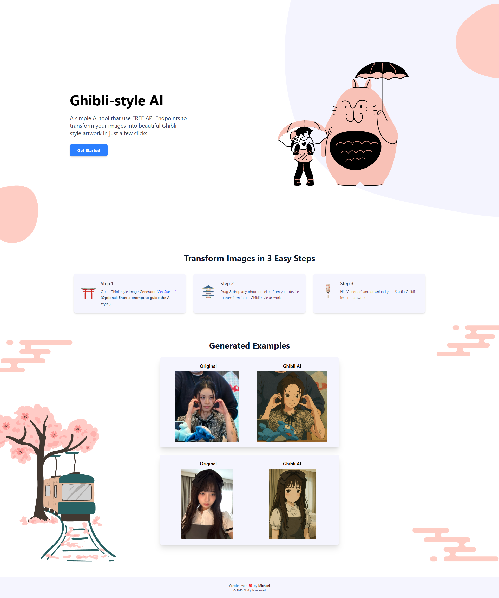

# 🏮 Free Ghibli AI Image Generator

Transform your photos into stunning Studio Ghibli-style artwork with AI! This fullstack application blends the magic of Hayao Miyazaki's world with modern web technologies.

✨ **[Live Demo](#)** *(Coming Soon)*



## ✨ Features
- 🖼️ **Drag & drop image uploads**
- ✍️ **Text prompts** ("Make it look like Spirited Away!")
- 🔄 **Real-time previews**

## 🛠 Tech Stack
| Frontend | Backend | Design |
|----------|---------|--------|
|    |    |  |

## 🚀 Quick Start

### Prerequisites
- Node.js ≥16
- npm ≥8

### Installation
```bash
# Clone repository
git clone https://github.com/mikartisan/react-ghibli-ai.git
cd ghibli-ai-generator

# Install backend dependencies
cd server
npm install

# Install frontend dependencies
cd ../client
npm install
